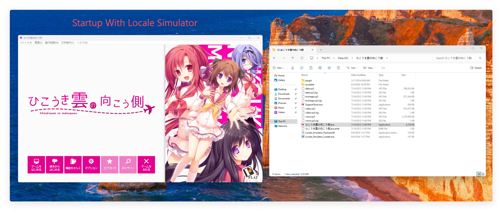

# Locale_Simulator

Windows Locale Simulator

## Todo

- Ntdll

  - [x] nls codepage path
  
- Message

  under implementation

- GID

   - Default FaceName

    under implementation

  - Default Charset

    under implementation

  under implementation

- LCID

  under implementation

- Timezone

  under implementation

## Supported System Version

- [x] Windows7 Wow64
- [x] Windows8 Wow64
- [x] Windows8.1 Wow64
- [x] Windows10 Wow64
- [x] Windows11 Wow64

- [ ] Windows7 x64 (under implementation)   
- [ ] Windows8 x64 (under implementation)  
- [ ] Windows8.1 x64 (under implementation)  
- [ ] Windows10 x64 (under implementation)   
- [ ] Windows11 x64 (under implementation)  
